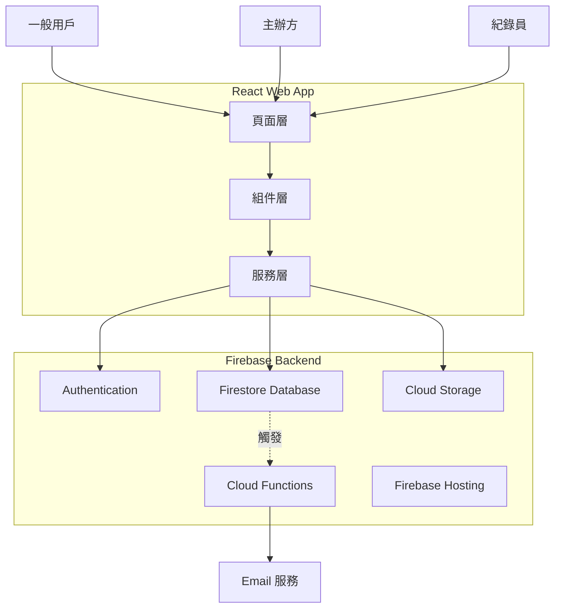
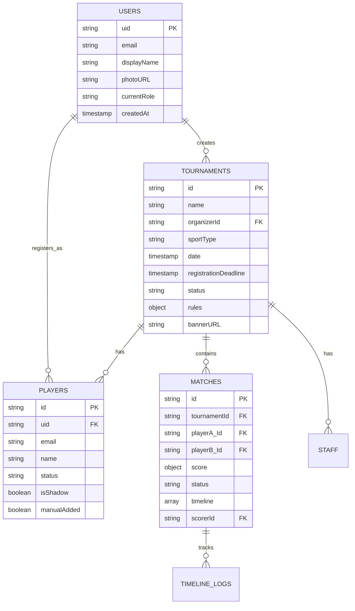

# SportFlow MVP 完整實施計劃

## 設計參考說明

本實施計劃已整合用戶提供的 UI 設計參考圖，將應用於所有表單頁面：**參考設計特點**：

- 🎨 橘色主色調 (#FF6B00)，現代感十足
- 📝 清晰的標籤 + 輸入框佈局
- 🎴 卡片式選項設計（帶價格/時間顯示）
- 🔘 大型固定底部操作按鈕
- 📊 步驟指示器引導用戶流程

此設計語言將貫穿整個應用，確保一致的用戶體驗。

## 架構概覽



## 資料結構設計



## UI 設計規範

### 設計參考

基於提供的 UI 參考圖，整個應用將採用以下設計語言：

#### 配色方案

- **主色調**：橘色 (#FF6B00)
- **背景色**：淺灰白色 (#F5F5F5)
- **卡片背景**：純白色 (#FFFFFF)
- **文字**：深灰色 (#333333) / 次要文字 (#999999)
- **強調色**：橘紅色用於價格、重要資訊

#### 核心 UI 元素

**1. 卡片式選項 (Selectable Card)**

- 白色背景，圓角 8px
- 未選中：灰色邊框 1px (#E0E0E0)
- 選中狀態：橘色邊框 2px (#FF6B00)
- 內容佈局：左側標題，右側價格/數值（橘色大字）
- 底部顯示次要資訊（如時間、分鐘數）

**2. 大型底部操作按鈕**

- 寬度：100% - 32px (左右各 16px margin)
- 高度：56px
- 背景色：漸層橘色 (#FF6B00 to #FF8C00)
- 文字：白色，字重 600，16px
- 圓角：12px
- 固定在底部，避免被鍵盤遮擋
- 陰影：0 -2px 8px rgba(0,0,0,0.1)

**3. 輸入框設計**

- 邊框：1px solid #E0E0E0
- 圓角：8px
- 內距：16px
- Placeholder：淡灰色 (#CCCCCC)
- Focus 狀態：邊框變橘色
- Label：上方 12px，深灰色，14px

**4. 下拉選單 (Select)**

- 與輸入框相同樣式
- 右側箭頭圖示
- 選項列表：白色背景，陰影卡片

**5. 步驟指示器 (Stepper)**

- 水平進度條
- 已完成步驟：橘色
- 當前步驟：橘色加粗
- 未完成步驟：淡灰色

#### 頁面佈局規範

**表單頁面結構**：

```javascript
┌─────────────────────┐
│  [返回] 標題        │  ← Header (固定)
├─────────────────────┤
│                     │
│  ● ○ ○ ○          │  ← 步驟指示器
│                     │
│  表單內容區域        │  ← 可滾動區域
│  - 標籤 + 輸入框    │
│  - 卡片式選項       │
│                     │
│                     │
├─────────────────────┤
│  [下一步]           │  ← 固定底部按鈕
└─────────────────────┘
```

#### 應用範圍

此 UI 規範將應用於：

- **建立賽事流程** (CreateTournament) - 4 步驟表單
- **報名表單** (RegistrationForm)
- **手動新增選手** (AddPlayerForm)
- **工作人員邀請** (InviteStaffForm)
- 所有需要用戶輸入的互動頁面

## 實施步驟

### 第一階段：核心服務層與資料模型

建立所有 Firestore 互動的服務層，確保資料邏輯集中管理。**檔案**：

- [`src/services/tournamentService.ts`](src/services/tournamentService.ts) - 賽事 CRUD、狀態管理
- [`src/services/matchService.ts`](src/services/matchService.ts) - 比賽場次管理、即時計分
- [`src/services/registrationService.ts`](src/services/registrationService.ts) - 報名邏輯、影子帳號建立
- [`src/services/staffService.ts`](src/services/staffService.ts) - 工作人員管理
- [`src/services/drawService.ts`](src/services/drawService.ts) - 自動抽籤演算法
- [`src/services/storageService.ts`](src/services/storageService.ts) - Firebase Storage 圖片上傳

**關鍵邏輯**：

- 自動抽籤演算法：支援循環賽 (Round-Robin) 與淘汰賽 (Knockout)
- 影子帳號建立與連結機制
- 賽事狀態自動流轉（根據報名截止日期、人數等）

### 第二階段：通用 UI 組件

建立可重複使用的 UI 組件，**嚴格遵循上述 UI 設計規範**。**檔案**：

- [`src/components/common/Button.tsx`](src/components/common/Button.tsx)
- 支援 `primary` (橘色)、`secondary`、`ghost` 變體
- 大型底部按鈕變體 (`fullWidth` prop)
- [`src/components/common/Card.tsx`](src/components/common/Card.tsx)
- 基礎白色卡片
- 可選中變體 (`selectable` prop)，選中時顯示橘色邊框
- [`src/components/common/SelectableCard.tsx`](src/components/common/SelectableCard.tsx) - **新增**
- 專門用於選項卡片（如服務項目選擇）
- 支援左側標題 + 右側價格/數值顯示
- 底部次要資訊顯示
- [`src/components/common/Input.tsx`](src/components/common/Input.tsx)
- 帶標籤的輸入框
- Focus 狀態橘色邊框
- [`src/components/common/Select.tsx`](src/components/common/Select.tsx)
- 下拉選單，樣式與 Input 一致
- 右側箭頭圖示
- [`src/components/common/Stepper.tsx`](src/components/common/Stepper.tsx) - **新增**
- 水平步驟指示器
- 橘色表示當前/已完成步驟
- [`src/components/common/Tabs.tsx`](src/components/common/Tabs.tsx)
- 底部橘色指示線
- [`src/components/common/Modal.tsx`](src/components/common/Modal.tsx)
- [`src/components/common/Loading.tsx`](src/components/common/Loading.tsx)

**樣式配置**：更新 [`src/styles/_variables.scss`](src/styles/_variables.scss)：

```scss
// 主色調
$primary-color: #ff6b00;
$primary-gradient: linear-gradient(135deg, #ff6b00 0%, #ff8c00 100%);

// 背景色
$bg-color: #f5f5f5;
$card-bg: #ffffff;

// 文字顏色
$text-primary: #333333;
$text-secondary: #999999;
$text-placeholder: #cccccc;

// 邊框
$border-color: #e0e0e0;
$border-active: $primary-color;

// 圓角
$radius-sm: 8px;
$radius-lg: 12px;

// 間距
$spacing-xs: 8px;
$spacing-sm: 12px;
$spacing-md: 16px;
$spacing-lg: 24px;
```

### 第三階段：功能性組件

**賽事相關**：

- [`src/components/features/TournamentCard.tsx`](src/components/features/TournamentCard.tsx) - 賽事卡片（支援不同狀態顯示）
- [`src/components/features/MatchCard.tsx`](src/components/features/MatchCard.tsx) - 比賽場次卡片
- [`src/components/features/LiveScoreboard.tsx`](src/components/features/LiveScoreboard.tsx) - 即時比分顯示

**互動組件**：

- [`src/components/features/RegistrationForm.tsx`](src/components/features/RegistrationForm.tsx) - 報名表單
- [`src/components/features/PlayerList.tsx`](src/components/features/PlayerList.tsx) - 選手列表管理
- [`src/components/features/BracketView.tsx`](src/components/features/BracketView.tsx) - 賽程表 (Bracket)

### 第四階段：一般用戶功能實現

#### A. 首頁 (Home)

更新 [`src/pages/Home.tsx`](src/pages/Home.tsx)：

- 頂部項目切換器（籃球/羽球/排球）
- 即時 Live Feed（顯示進行中的比賽）
- 使用 `onSnapshot` 監聽 Firestore 即時更新

#### B. 賽事頁面

更新 [`src/pages/Events.tsx`](src/pages/Events.tsx)：

- 賽事列表（篩選：開放報名中、進行中）
- 新增 [`src/pages/EventDetail.tsx`](src/pages/EventDetail.tsx) - 賽事詳情與報名按鈕
- 新增路由：`/events/:id`

#### C. 我的比賽

更新 [`src/pages/MyGames.tsx`](src/pages/MyGames.tsx)：

- Tab 1: 即將到來
- Tab 2: 歷史紀錄
- 新增 [`src/pages/MatchDetail.tsx`](src/pages/MatchDetail.tsx) - 單場比賽詳情（比分 Timeline）

#### D. 個人檔案

更新 [`src/pages/Profile.tsx`](src/pages/Profile.tsx)：

- 視角切換（User / Organizer / Scorer）
- 更新 `currentRole` 到 Firestore
- 根據角色顯示不同的快速操作

### 第五階段：主辦方功能

#### A. 主辦方首頁

新增 [`src/pages/organizer/OrganizerHome.tsx`](src/pages/organizer/OrganizerHome.tsx)：

- 顯示「我舉辦的賽事」列表
- 快速建立賽事按鈕

#### B. 建立賽事流程

新增 [`src/pages/organizer/CreateTournament.tsx`](src/pages/organizer/CreateTournament.tsx)：

- **參考附圖的 UI 設計**，實現 4 步驟表單
- 使用 `<Stepper>` 組件顯示進度
- 每個步驟使用 `<Input>` 和 `<SelectableCard>` 組件
- 底部固定 `<Button fullWidth>` 顯示「下一步」/「完成」
- 整合 `storageService` 上傳 Banner 圖片

**步驟設計**：

1. **基本資訊**：賽事名稱 (Input)、項目選擇 (SelectableCard)、Banner 上傳
2. **時間地點**：比賽日期 (DatePicker)、報名截止 (DatePicker)、地點 (Input)
3. **賽制規格**：賽制 (SelectableCard)、人數上限 (Input)、計分規則 (Input)
4. **文宣說明**：詳細說明 (Textarea)

#### C. 賽事儀表板

新增 [`src/pages/organizer/TournamentDashboard.tsx`](src/pages/organizer/TournamentDashboard.tsx)：

- **Tab 1: 人員管理**
- 子 Tab: 選手管理（審核報名、手動新增）
- 子 Tab: 工作人員管理（邀請紀錄員）
- **Tab 2: 賽程管理**
- 自動抽籤按鈕（呼叫 `drawService`）
- 預覽與發布賽程

路由：`/organizer/tournaments/:id`

### 第六階段：紀錄員功能

#### A. 紀錄員首頁

新增 [`src/pages/scorer/ScorerHome.tsx`](src/pages/scorer/ScorerHome.tsx)：

- 顯示被指派的場次列表
- 狀態篩選：待開始、進行中、已完成

#### B. 計分板 Console

新增 [`src/pages/scorer/ScoringConsole.tsx`](src/pages/scorer/ScoringConsole.tsx)：

- 大型得分按鈕（A 隊 / B 隊）
- Undo 功能
- 即時同步到 Firestore（`onSnapshot` 監聽）
- 比賽結束確認與上傳

路由：`/scorer/matches/:id`

### 第七階段：訪客模式與路由守衛

新增 [`src/components/guards/AuthGuard.tsx`](src/components/guards/AuthGuard.tsx)：

- 檢查 `currentUser`，若無則重定向到 `/login`
- 在需要登入的頁面包裹此守衛

新增 [`src/components/guards/RoleGuard.tsx`](src/components/guards/RoleGuard.tsx)：

- 檢查用戶 `currentRole`，若不符則顯示提示

更新 [`src/App.tsx`](src/App.tsx)：

- 整合所有新路由
- 應用路由守衛

### 第八階段：Firebase Functions (Email 通知)

建立 [`functions/`](functions/) 目錄：

- `functions/src/index.ts` - Cloud Functions 入口
- `functions/src/notifications/` - 通知邏輯

**觸發器**：

1. **報名確認**：當 `players/{playerId}` 的 `status` 變為 `confirmed` 時發送 Email
2. **賽程發布**：當 `tournaments/{id}` 的 `status` 變為 `scheduled` 時通知所有選手
3. **工作人員邀請**：當建立 `staff` 文件時發送邀請信

**Email 服務**：使用 Nodemailer + Gmail SMTP 或 SendGrid 配置：

- `functions/package.json`
- `functions/tsconfig.json`
- `.env` 檔案設定 Email 服務憑證

### 第九階段：Firestore Security Rules

建立 [`firestore.rules`](firestore.rules)：

- 用戶只能讀寫自己的 `users/{uid}` 文件
- 主辦方可管理自己的 `tournaments`
- 紀錄員可更新被指派的 `matches`
- 一般用戶可讀取公開賽事與比賽

建立 [`storage.rules`](storage.rules)：

- 僅登入用戶可上傳
- 所有人可讀取公開圖片

### 第十階段：環境配置與部署

**環境變數**：

- 建立 [`.env.example`](.env.example) 範本
- 文件說明如何設定 Firebase Config

**Firebase Hosting**：

- 初始化：`firebase init hosting`
- 配置 [`firebase.json`](firebase.json)
- 部署指令：`npm run build && firebase deploy`

**文件更新**：

- 更新 [`README.md`](README.md)，包含：
- 專案簡介
- 安裝與啟動步驟
- Firebase 設定指南
- 部署流程

### 第十一階段：測試與優化

- 測試所有角色流程
- 確認即時同步功能正常
- Mobile 響應式檢查
- Loading 狀態與錯誤處理
- 修復任何 linter 錯誤

## 技術重點

### 即時同步 (Real-time Sync)

使用 Firestore `onSnapshot` 監聽：

- Live Feed 自動更新
- 計分板即時同步
- 選手看到最新比分

### 自動抽籤演算法

- **循環賽**：所有選手互相對戰一次（n \* (n-1) / 2 場）
- **淘汰賽**：單淘汰制，自動產生對戰樹

### 狀態流轉邏輯

賽事狀態自動判斷：

```typescript
if (now < registrationDeadline && players < maxPlayers) → 'open'
if (now >= registrationDeadline && !drawn) → 'locked'
if (drawn && !published) → 'processing'
if (published) → 'scheduled'
if (anyMatchLive) → 'live'
if (allMatchesFinished) → 'finished'
```

## 關鍵檔案清單

### 新增檔案（約 45+ 個）

- 6 個服務層檔案
- 9 個通用組件（包含 SelectableCard、Stepper）
- 6 個功能組件
- 10+ 個頁面檔案
- 2 個路由守衛
- Firebase Functions 相關檔案
- Security Rules 檔案
- 配置檔案

### 修改檔案

- [`src/App.tsx`](src/App.tsx) - 新增路由
- [`src/types/index.ts`](src/types/index.ts) - 擴充類型定義
- [`src/styles/_variables.scss`](src/styles/_variables.scss) - 新增橘色主題配色系統
- [`src/components/layout/BottomNav.tsx`](src/components/layout/BottomNav.tsx) - 動態導航（根據角色）
- [`src/pages/Profile.tsx`](src/pages/Profile.tsx) - 視角切換

## 預計工作量

此專案規模較大，預計需要：

- **150-200** 次工具調用
