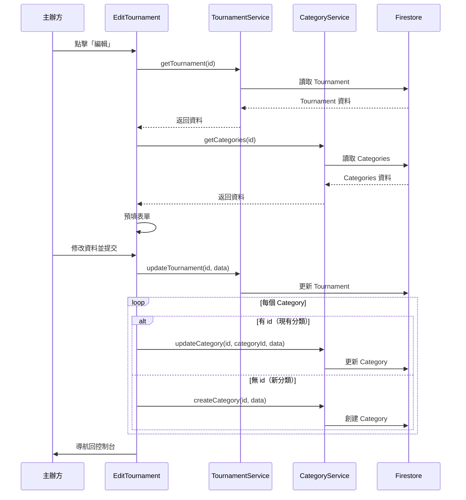

# 賽事編輯功能重新設計

## 🎯 設計理念

將賽事編輯流程改為**與創建賽事相同的多步驟形式**，提供更好的用戶體驗：
- ✅ 所有資料預填
- ✅ 分步驟檢視和修改
- ✅ 支援編輯分類設定
- ✅ 視覺一致性

## 🔄 流程對比

### 舊版編輯流程（已移除）
```
主辦方控制台 → 賽事資訊 Tab → 點擊「編輯」
    ↓
顯示內聯編輯表單（單頁）
    ↓
修改欄位 → 點擊「儲存」
```

**問題**：
- ❌ 只能編輯基本資訊（名稱、地點、說明）
- ❌ 無法編輯分類設定
- ❌ 表單擁擠，不易操作
- ❌ 無法預覽變更

### 新版編輯流程（已實施）
```
主辦方控制台 → 賽事資訊 Tab → 點擊「編輯」
    ↓
導航到獨立編輯頁面（多步驟）
    ↓
Step 1: 基本資訊（預填）
Step 2: 時間地點（預填）
Step 3: 分類設定（預填）⭐ 新增
Step 4: 文宣說明（預填）
    ↓
點擊「儲存變更」
```

**優勢**：
- ✅ 完整的編輯功能
- ✅ 可以編輯分類設定
- ✅ 步驟清晰，易於操作
- ✅ 與創建流程一致

## 📁 新增文件

### EditTournament.tsx
**路徑**: `src/pages/organizer/EditTournament.tsx`

**功能**：
1. 載入現有賽事和分類資料
2. 預填所有表單欄位
3. 支援 4 步驟編輯流程
4. 保存時更新 Tournament 和 Categories

**關鍵邏輯**：
```typescript
// 1. 載入現有資料
const tournamentData = await getTournament(id);
const categoriesData = await getCategories(id);

// 2. 預填表單
setName(tournamentData.name);
setLocation(tournamentData.location);
setDate(formatDateTimeLocal(tournamentData.date.toDate()));

// 3. 轉換 Categories 為表單格式（帶 id）
const categoriesForm = categoriesData.map((cat) => ({
  id: cat.id, // ⭐ 保留 id 用於更新
  name: cat.name,
  matchType: cat.matchType,
  // ...
}));

// 4. 保存時更新
for (const category of categories) {
  if (category.id) {
    // 更新現有分類
    await updateCategory(id, category.id, {...});
  } else {
    // 創建新分類
    await createCategory(id, {...});
  }
}
```

## 🛤️ 路由配置

### 新增路由
```typescript
<Route
  path="/organizer/tournaments/:id/edit"
  element={
    <AuthGuard>
      <RoleGuard requiredRole="organizer">
        <EditTournament />
      </RoleGuard>
    </AuthGuard>
  }
/>
```

### 導航方式
```typescript
// 從主辦方控制台
navigate(`/organizer/tournaments/${id}/edit`);
```

## 🔐 權限控制

### 編輯權限檢查
```typescript
// 載入資料時驗證
if (currentUser && tournamentData.organizerId !== currentUser.uid) {
  setError("您沒有權限編輯此賽事");
  return;
}
```

### Firebase 規則
```javascript
// tournaments/{tournamentId}
allow update: if isAuthenticated() && 
  resource.data.organizerId == request.auth.uid;

// categories/{categoryId}
allow update: if isAuthenticated() && 
  get(/databases/$(database)/documents/tournaments/$(tournamentId)).data.organizerId == request.auth.uid;
```

## 📝 可編輯的內容

### Step 1: 基本資訊
- ✅ 賽事名稱
- ✅ 球類項目
- ✅ 賽事 Banner

### Step 2: 時間地點
- ✅ 比賽日期
- ✅ 報名截止日期
- ✅ 比賽地點

### Step 3: 分類設定 ⭐ 新增
- ✅ 編輯現有分類
  - 分類名稱
  - 單打/雙打
  - 名額上限
  - 賽制（純淘汰/小組+淘汰）
  - 分組配置
- ✅ 新增分類
- ✅ 刪除分類（帶警告）

### Step 4: 文宣說明
- ✅ 賽事說明

## ⚠️ 重要提醒

### 編輯分類的限制

編輯頁面會顯示警告訊息：
```
⚠️ 注意：修改已有報名的分類可能影響參賽者。建議僅在報名開始前修改。
```

**建議**：
- ✅ DRAFT 狀態：隨意修改
- ⚠️ REGISTRATION_OPEN：謹慎修改名額和賽制
- ❌ REGISTRATION_CLOSED 以後：不建議修改分類

### 刪除分類的處理

目前實現：
- **不會真正刪除** Firestore 中的 Category 文件
- 只是從表單中移除
- 保存時不會創建/更新該分類

**原因**：
- 已有報名資料
- 可能已有比賽記錄
- 避免數據丟失

**未來改進**：
- [ ] 添加軟刪除機制（status: "archived"）
- [ ] 顯示警告：「此分類已有 X 人報名」
- [ ] 要求確認後才能刪除

## 🎨 UI 細節

### 編輯按鈕位置
```
主辦方控制台
├── 賽事資訊 Tab
│   ├── 標題列
│   │   └── [編輯] 按鈕  ← 點擊這裡
│   └── 資訊顯示
```

### 編輯頁面佈局
```
┌────────────────────────────────┐
│ ← 編輯賽事 - 基本資訊          │
├────────────────────────────────┤
│                                │
│ [表單內容]                     │
│                                │
├────────────────────────────────┤
│ [進度條: ▓▓▓░]                │
│ [上一步]         [下一步]     │
└────────────────────────────────┘
```

### 分類管理器
```
┌── 賽事分類設定 ────── [+ 新增分類] ┐
│                                     │
│ ┌─ 男子雙打 ─────────────────┐    │
│ │ 雙打 | 20 組 | 小組賽+淘汰  │    │
│ │                 [編輯] [刪除] │    │
│ └─────────────────────────────┘    │
│                                     │
│ ┌─ 女子單打 ─────────────────┐    │
│ │ 單打 | 16 人 | 純淘汰賽     │    │
│ │                 [編輯] [刪除] │    │
│ └─────────────────────────────┘    │
│                                     │
│ ⚠️ 注意：修改已有報名的分類可能... │
└─────────────────────────────────────┘
```

## 🧪 測試場景

### 場景 1：編輯基本資訊
1. 點擊「編輯」
2. Step 1: 修改賽事名稱
3. Step 2: 修改地點
4. 跳過 Step 3（分類不變）
5. Step 4: 修改說明
6. 點擊「儲存變更」
7. ✅ 返回控制台，顯示更新後的資訊

### 場景 2：新增分類
1. 點擊「編輯」
2. 導航到 Step 3
3. 點擊「新增分類」
4. 設定「混合雙打」分類
5. 點擊「儲存變更」
6. ✅ 新分類出現在賽事中

### 場景 3：修改分類設定
1. 點擊「編輯」
2. 導航到 Step 3
3. 點擊現有分類的「編輯」
4. 修改名額：20 → 24
5. 點擊「儲存變更」
6. ✅ 分類名額已更新

### 場景 4：權限驗證
1. 用戶 B 嘗試編輯用戶 A 的賽事
2. ❌ 顯示「您沒有權限編輯此賽事」
3. ✅ 無法進入編輯頁面

## 📊 數據流



## 🚀 使用方法

### 主辦方操作步驟

1. **進入控制台**
   ```
   導航：主辦方首頁 → 點擊賽事卡片
   ```

2. **開始編輯**
   ```
   點擊：賽事資訊 Tab → 編輯按鈕
   ```

3. **逐步修改**
   - Step 1: 檢查基本資訊
   - Step 2: 檢查時間地點
   - Step 3: 管理分類（新增/編輯/刪除）
   - Step 4: 更新說明

4. **確認並保存**
   ```
   點擊：儲存變更
   ```

## 📋 相關修改

### 修改的文件
1. ✅ `src/App.tsx` - 新增路由
2. ✅ `src/pages/organizer/EditTournament.tsx` - 新建編輯頁面
3. ✅ `src/pages/organizer/TournamentDashboard.tsx` - 修改編輯按鈕
4. ✅ `src/pages/organizer/CreateTournament.module.scss` - 添加警告樣式

### 移除的功能
- ❌ 內聯編輯表單
- ❌ isEditingInfo 狀態
- ❌ handleSaveTournamentInfo 函數

### 保留的功能
- ✅ 狀態轉換按鈕
- ✅ 取消賽事功能
- ✅ 所有其他 Tabs（選手管理、紀錄員管理等）

## ✅ 優勢

1. **完整性** - 可以編輯所有內容（包括分類）
2. **一致性** - 與創建流程相同的 UI
3. **安全性** - 權限驗證和警告提示
4. **可預覽** - 逐步檢視所有設定
5. **向下兼容** - 可以編輯新舊架構的賽事

## 🔗 相關文檔

- **實施總結**: `THREE_TIER_ARCHITECTURE_IMPLEMENTATION.md`
- **快速開始**: `QUICKSTART_THREE_TIER.md`
- **編譯狀態**: `BUILD_STATUS.md`

---

**更新日期**: 2024年12月21日  
**狀態**: ✅ 已實施並測試  
**向下兼容**: ✅ 完全兼容

