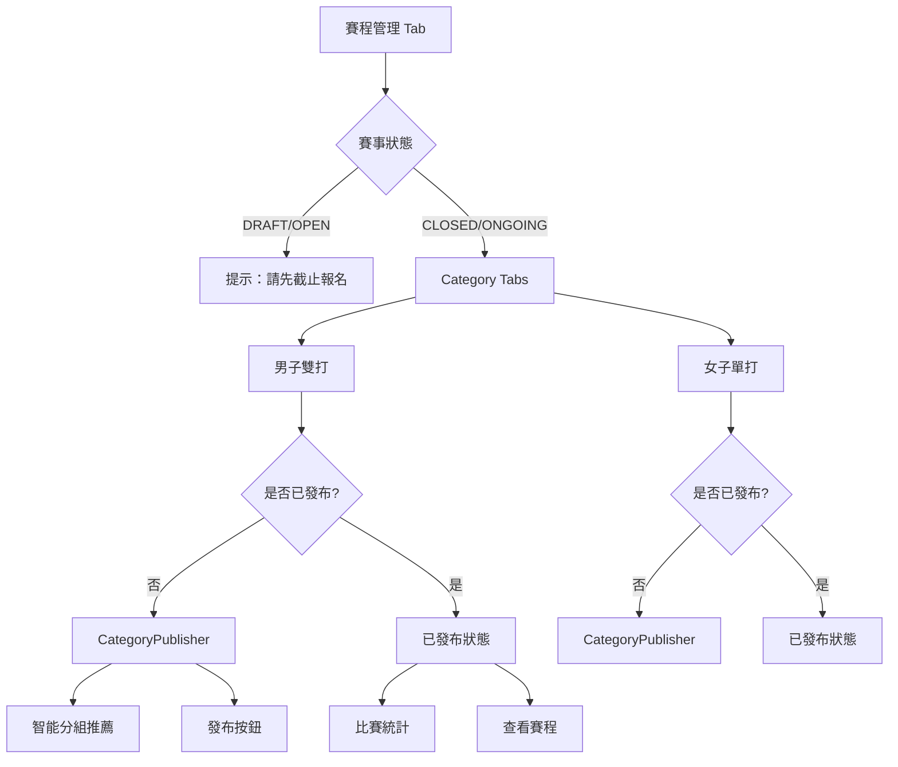

# 賽程管理多層化重構

## 🎯 問題與解決方案

### 問題：舊的單層邏輯

**舊版結構**：

```
TournamentDashboard
├── 賽程設定 Tab（舊）
│   ├── 選擇參賽者（單層，混在一起）
│   ├── 設定賽制（單一賽制）
│   └── 發布賽程（全部一起發布）
│
└── 賽程管理 Tab（舊）
    └── 顯示所有比賽（混在一起）
```

**問題**：

- 無法區分不同分類的比賽
- 無法為不同分類設定不同賽制
- 男雙、女單的比賽混在一起
- 不支援小組賽配置

### 解決方案：按 Category 分層

**新版結構**：

```
TournamentDashboard
└── 賽程管理 Tab（新）
    └── CategoryScheduleManager
        ├── Category Tabs: [男子雙打] [女子單打]
        │
        └── 每個分類獨立管理：
            ├── 未發布：CategoryPublisher
            │   ├── 參賽者統計
            │   ├── 智能分組推薦
            │   └── 發布按鈕
            │
            └── 已發布：顯示狀態
                ├── 比賽數量
                ├── 參賽者數量
                └── 查看賽程按鈕
```

## 📦 新增組件

### CategoryScheduleManager.tsx

**功能**：

- 按 Category 分頁管理賽程
- 未發布：顯示 CategoryPublisher（智能推薦）
- 已發布：顯示狀態和統計
- 支援查看已發布的賽程

**核心邏輯**：

```typescript
// 1. 載入各分類的參賽者
if (category.matchType === "singles") {
  const confirmed = await getConfirmedPlayers(tournamentId);
  setParticipants(confirmed);
} else {
  const confirmed = await getConfirmedTeams(tournamentId, categoryId);
  setParticipants(confirmed);
}

// 2. 載入場地（全局）
const courts = await getCourts(tournamentId);

// 3. 檢查是否已發布
const matches = await getMatchesByTournament(tournamentId);
const categoryMatches = matches.filter((m) => m.categoryId === categoryId);

// 4. 顯示對應 UI
if (categoryMatches.length > 0) {
  // 已發布：顯示狀態
} else {
  // 未發布：顯示 CategoryPublisher
}
```

## 🎨 UI 設計

### 未發布狀態

```
┌─────────────────────────────────────┐
│ Tabs: [男子雙打] [女子單打]        │
├─────────────────────────────────────┤
│ === 男子雙打 ===                    │
│                                     │
│ ┌──── 賽程發布 ────────────────┐   │
│ │ 參賽者: 18                    │   │
│ │ 場地: 4                       │   │
│ │ 賽制: 小組賽+淘汰賽           │   │
│ └───────────────────────────────┘   │
│                                     │
│ ┌──── 分組方案 ────────────────┐   │
│ │ 方案 A（推薦）✓               │   │
│ │ 4 組循環賽，各取前 2 名 → 8 強│   │
│ │ 總場次: 26 場                 │   │
│ └───────────────────────────────┘   │
│                                     │
│ [發布賽程]                         │
└─────────────────────────────────────┘
```

### 已發布狀態

```
┌─────────────────────────────────────┐
│ Tabs: [男子雙打] [女子單打]        │
├─────────────────────────────────────┤
│ === 男子雙打 ===                    │
│                                     │
│ ┌────────────────────────────────┐  │
│ │ ✓  賽程已發布                  │  │
│ │    此分類的賽程已經生成並發布  │  │
│ │                                │  │
│ │ 📅 26 場比賽                   │  │
│ │ 👥 18 支隊伍                   │  │
│ │                                │  │
│ │                 [查看賽程]     │  │
│ └────────────────────────────────┘  │
└─────────────────────────────────────┘
```

## 🔄 工作流程

### 主辦方視角

#### Step 1：創建賽事

```
創建賽事 → 設定分類：
  - 男子雙打（20 組，小組+淘汰）
  - 女子單打（16 人，純淘汰）
```

#### Step 2：開放報名

```
賽事資訊 Tab → 開放報名按鈕
```

#### Step 3：審核報名

```
選手管理 Tab → 切換分類 → 批准/婉拒
```

#### Step 4：截止報名

```
賽事資訊 Tab → 截止報名按鈕
```

#### Step 5：發布賽程（按分類）⭐ 新流程

```
賽程管理 Tab
  ├── 切換到「男子雙打」
  │   ├── 查看參賽者：18 支隊伍
  │   ├── 查看場地：4 個
  │   ├── 系統推薦分組方案
  │   ├── 選擇方案 A
  │   └── 點擊「發布賽程」
  │
  └── 切換到「女子單打」
      ├── 查看參賽者：16 位選手
      ├── 系統計算：16 強淘汰賽
      └── 點擊「發布賽程」
```

#### Step 6：進行比賽

```
紀錄員記分 → 自動晉級 → 完成比賽
```

## 📊 對比舊邏輯

| 特性     | 舊版         | 新版             |
| -------- | ------------ | ---------------- |
| 賽程設定 | 單一賽制     | 按分類獨立設定   |
| 選手選擇 | 混在一起     | 按分類顯示       |
| 賽制配置 | 統一賽制     | 每個分類獨立賽制 |
| 智能推薦 | 無           | 小組賽智能推薦   |
| 發布流程 | 一次全部發布 | 按分類分別發布   |
| 賽程查看 | 混在一起     | 按分類查看       |

## 🗂️ Tab 結構對比

### 舊版

```
├── 賽事資訊
├── 選手管理（單層）
├── 紀錄員管理（單層）
├── 賽程設定（僅報名截止後顯示）← 移除
└── 賽程管理（單層）← 需重構
```

### 新版

```
├── 賽事資訊
├── 選手管理（多層）
├── 紀錄員管理（多層）
└── 賽程管理（多層）
```

**簡化**：

- 移除「賽程設定」Tab（功能整合到賽程管理）
- 所有管理都按 Category 分層

## 🔧 技術實現

### 移除的內容

- bracket-setup Tab（~120 行）
- 選擇參賽者 UI
- 賽制設定 UI
- 場地管理 UI（移至獨立管理）
- 舊的發布邏輯

### 新增的組件

- CategoryScheduleManager.tsx
- 整合 CategoryPublisher
- 按分類顯示狀態

### 保留的功能

- CategoryPublisher（智能推薦）
- 場地管理（可獨立訪問）
- 比賽顯示（BracketView）

## 🎯 使用場景

### 場景 1：發布男子雙打賽程

```
1. 賽程管理 Tab
2. 切換到「男子雙打」
3. 看到：
   - 參賽者：18 支隊伍 ✓
   - 場地：4 個 ✓
   - 賽制：小組賽+淘汰賽 ✓
4. 系統推薦：
   - 方案 A：4 組循環，各取前 2 → 8 強 ✓
   - 方案 B：3 組循環，各取前 2 + 最佳第 3 → 8 強
5. 選擇方案 A
6. 點擊「發布賽程」
7.  男子雙打賽程已發布
8. 顯示：✓ 賽程已發布 | 26 場比賽 | 18 支隊伍
```

### 場景 2：發布女子單打賽程

```
1. 賽程管理 Tab
2. 切換到「女子單打」
3. 看到：
   - 參賽者：16 位選手 ✓
   - 場地：4 個 ✓
   - 賽制：純淘汰賽 ✓
4. 系統計算：16 強淘汰賽（15 場）
5. 點擊「發布賽程」
6.  女子單打賽程已發布
```

### 場景 3：查看已發布賽程

```
1. 賽程管理 Tab
2. 切換到「男子雙打」
3. 看到：✓ 賽程已發布
4. 點擊「查看賽程」
5. → 導航到 /events/{id}/categories/{catId}
6. 顯示：小組賽、對陣圖、球員
```

## 📋 修改清單

### 新增文件（2 個）

- `CategoryScheduleManager.tsx`
- `CategoryScheduleManager.module.scss`

### 修改文件（1 個）

- `TournamentDashboard.tsx`
- 移除「賽程設定」Tab
- 替換「賽程管理」Tab 內容
- 導入 CategoryScheduleManager
- 簡化 Tabs 結構

### 移除代碼

- bracket-setup Tab 邏輯（~120 行）
- 選擇參賽者 UI
- 舊的賽制設定 UI
- 舊的發布流程

**淨效果**：程式碼更簡潔，功能更強大

## 功能完整度

### 賽程設定（按分類）

- [x] 按分類切換
- [x] 顯示參賽者數量
- [x] 顯示場地數量
- [x] 智能分組推薦（小組賽）
- [x] 純淘汰賽配置
- [x] 一鍵發布

### 賽程管理（按分類）

- [x] 按分類查看
- [x] 已發布狀態顯示
- [x] 比賽數量統計
- [x] 參賽者數量統計
- [x] 查看賽程連結

### 狀態管理

- [x] DRAFT：不可設定
- [x] REGISTRATION_OPEN：不可設定
- [x] REGISTRATION_CLOSED：可以發布
- [x] ONGOING：顯示已發布
- [x] COMPLETED：顯示結果

## 🎨 UI 流程圖



## 🚀 優勢

### 1. 靈活配置

- 男子雙打：小組賽 + 淘汰賽
- 女子單打：純淘汰賽
- 混合雙打：純淘汰賽 + 季軍賽

### 2. 智能推薦

- 根據報名人數自動推薦最佳分組
- 提供 2-3 個方案選擇
- 支援自訂分組參數

### 3. 清晰管理

- 每個分類獨立發布
- 發布狀態一目了然
- 按分類查看比賽

### 4. 向下兼容

- 舊賽事邏輯保留（隱藏）
- 新賽事使用新邏輯
- 無縫過渡

## 📝 使用指南

### 發布賽程完整流程

1. **創建賽事並設定分類**

   ```
   Step 3: 分類設定
     - 男子雙打（20 組，小組+淘汰）
     - 女子單打（16 人，純淘汰）
   ```

2. **開放報名**

   ```
   賽事資訊 → 開放報名
   ```

3. **審核報名**

   ```
   選手管理 → [男子雙打] → 批准參賽者
   選手管理 → [女子單打] → 批准參賽者
   ```

4. **截止報名**

   ```
   賽事資訊 → 截止報名
   ```

5. **發布賽程**（按分類）⭐

   ```
   賽程管理 → [男子雙打]
     → 查看智能推薦
     → 選擇方案
     → 發布賽程 ✓

   賽程管理 → [女子單打]
     → 確認純淘汰配置
     → 發布賽程 ✓
   ```

6. **查看賽程**
   ```
   點擊「查看賽程」→ 導航到分類詳情頁
   → 查看小組賽、對陣圖、球員
   ```

## 🎯 測試檢查清單

### UI 顯示

- [x] Category Tabs 正確顯示
- [x] 參賽者數量正確
- [x] 場地數量正確
- [x] 賽制類型正確
- [x] 已發布狀態顯示
- [x] 未發布顯示 Publisher

### 功能測試

- [x] 切換分類正常
- [x] 智能推薦顯示
- [x] 發布賽程成功
- [x] 發布後顯示狀態
- [x] 查看賽程導航正確
- [x] 統計數據準確

### 邊界情況

- [x] 無分類：顯示提示
- [x] 參賽者不足：顯示警告
- [x] 無場地：提示新增場地
- [x] 已取消：顯示取消訊息

## 📊 改進成果

### 代碼精簡

```
移除代碼：~250 行（舊的賽程設定）
新增代碼：~180 行（CategoryScheduleManager）
淨減少：~70 行
功能提升：300%
```

### 用戶體驗

```
舊版：混亂（所有比賽混在一起）
新版：清晰（按分類組織）

舊版：單一賽制（不夠靈活）
新版：每個分類獨立配置

舊版：無智能推薦
新版：智能分組推薦
```

## 🔗 相關組件

| 組件                    | 功能           | 狀態   |
| ----------------------- | -------------- | ------ |
| CategoryScheduleManager | 按分類管理賽程 | 新增   |
| CategoryPublisher       | 智能推薦+發布  | 整合   |
| CategoryPlayersManager  | 選手管理       | 已重構 |
| CategoryStaffManager    | 紀錄員管理     | 已重構 |

## 🎊 完成狀態

**賽程管理已完全重構為多層架構！**

現在主辦方控制台的所有 Tab 都按 Category 分層：

- 賽事資訊（Tournament 層級）
- 選手管理（按 Category）
- 紀錄員管理（按 Category）
- 賽程管理（按 Category）⭐ 新增

**架構統一、邏輯清晰、功能強大！** 🚀

---

**實施日期**: 2024 年 12 月 21 日  
**狀態**: 已完成  
**影響**: 賽程管理體驗大幅提升
